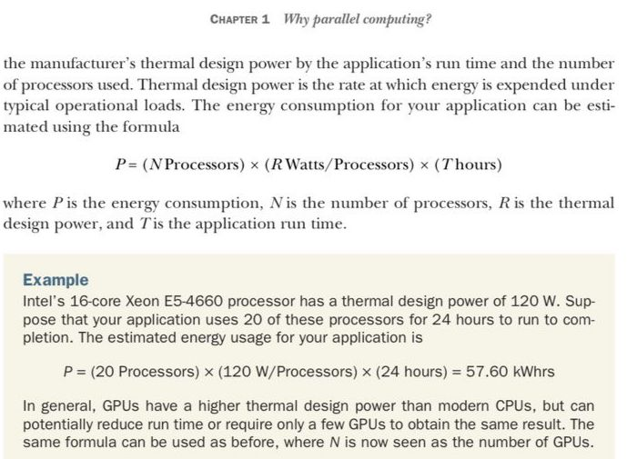

<p align="center">
  <a href="" rel="noopener">
 </a>
</p>

<h2 align="center">Assignment 2</h2>

<div align="center">

[]()
[](https://github.com/kylelobo/The-Documentation-Compendium/issues)
[](https://github.com/kylelobo/The-Documentation-Compendium/pulls)
[](/LICENSE)

</div>

## 📝 Table of Contents

- [About](#about)
- [Getting Started](#getting_started)
- [Built Using](#built_using)
- [Authors](#authors)
- [Acknowledgments](#acknowledgement)

## 🧐 About <a name = "about"></a>

The exercise was to recreate the formula of calculating the power consumption to a situation of a store. 

## 🏁 Getting Started <a name = "getting_started"></a>

You can clone this repository by running the following command

<h3> GitHub CLI </h3>

```
gh repo clone https://github.com/Norberto-Boa/CounterParallelism.git
```

<h3>Git clone</h3>

```
git clone https://github.com/Norberto-Boa/CounterParallelism.git
```

Then you must navigate to the project directory.
### Prerequisites

To run this code you need to have node installed.


### Installing

You must navigate to the Assignment directory and then install all the dependencies needed for this project.

Navigate to the project directory

```
cd Assignment/2/
```

Install all the dependencies needed for this project

```
npm install 
```

Run the project

```
node Exercise2.js 
```


## ⛏️ Built Using <a name = "built_using"></a>

- [readlineSync](https://github.com/anseki/readline-sync) - Interaction


## ✍️ Authors <a name = "authors"></a>

- [Norberto Boa](https://github.com/Norberto-Boa) - FullStack Developer
- [Jennifer Manhice ](https://github.com/JenManhice) - Backend Developer
- [Frank Coutinho](https://github.com/Frank-Coutinho) - Backend Developer

## 🎉 Acknowledgements <a name = "acknowledgement"></a>

- Exercise given by [Lars Albino Lemos](https://github.com/larslemos)
